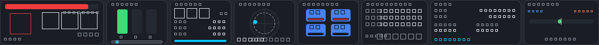

# FH6Telemetry

A real-time telemetry overlay for **Forza Horizon 6**, written in Python.

FH6Telemetry listens to the game's "Data Out" UDP stream, derives a rich set of
analytics, and renders them in a compact, transparent, always-on-top HUD you can
keep on screen while you drive.



> The preview above is rendered headlessly for the docs; text glyphs appear as
> boxes only in that offscreen environment. On a real Windows desktop the HUD
> renders with full fonts.

## Features

Everything is computed live from the telemetry stream and laid out in eight
compact panels:

| Panel | What it shows |
|-------|---------------|
| **Core** | Current gear, an RPM bar with a colour shift light, and speed |
| **Inputs** | Throttle / brake / clutch bars and a steering indicator |
| **Engine** | Power (hp), torque (Nm), boost (psi), drivetrain, fuel |
| **G-Force** | Live traction circle with a peak-g ring |
| **Tyres** | Per-corner temperatures (colour-coded to the grip window) and combined-slip strips |
| **Handling** | Understeer/oversteer balance derived from per-axle slip angles |
| **Laps** | Lap counter, position, current/last/best times and a **predictive delta** to your best lap |
| **Performance** | Acceleration runs (0-100, 0-200, 100-200, ¼-mile), top speed and peak power records |

Additional highlights:

- **Shift advisor** that *learns* the engine's power band and recommends the
  optimal upshift point (with a flashing shift light at the limit).
- **Predictive lap delta** built from a distance-indexed trace of your best lap.
- **Click-through overlay**: input passes straight to the game; toggle
  interactivity to drag/reposition the HUD.
- **System-tray controls**: interactivity, position lock, metric/imperial units,
  session reset and quit.
- **Robust decoder** supporting every documented Forza wire format (Sled 232,
  FM7 Dash 311, Horizon 324, FM 2023 Dash 331).

## Requirements

- Python 3.10+
- [PySide6](https://pypi.org/project/PySide6/) (Qt for Python)
- Windows is recommended (click-through pass-through uses the Win32 API); the
  HUD itself runs anywhere Qt does.

## Installation

```bash
python -m venv .venv
.venv\Scripts\activate        # Windows
# source .venv/bin/activate   # macOS / Linux
pip install -r requirements.txt
```

## Configuring Forza "Data Out"

In the game: **Settings → HUD and Gameplay → Telemetry / Data Out**

1. **Data Out**: `ON`
2. **Data Out IP Address**: the IP of the machine running this overlay
3. **Data Out IP Port**: `5300` (or any free 1024-65535 port)
4. **Packet Format**: `Car Dash` (Forza Horizon always uses the Dash format)

> Forza Horizon does **not** send telemetry to `127.0.0.1`. To use the overlay on
> the *same* PC as the game, point "Data Out IP Address" at your LAN IP (e.g.
> `192.168.x.x`); Windows loops it back to the listener bound on `0.0.0.0`.

## Usage

```bash
python -m fh6telemetry                 # listen on 0.0.0.0:5300, metric units
python -m fh6telemetry --port 5300
python -m fh6telemetry --imperial      # mph / Fahrenheit
```

The overlay opens as a **horizontal strip** along the **bottom centre** of your
screen. Right-click the tray icon for runtime controls. To reposition the HUD,
untick **Interactive (click-through off)**, drag it, then re-enable
click-through. Use **Reset position (bottom centre)** to snap it back.

Window position and preferences are remembered in `config.local.json` in the
working directory. Set `"window_x": -1, "window_y": -1` to re-enable the
bottom-centre anchor on next launch.

## Lab (offline analysis)

The **Lab** workbench runs synthetic scenarios and plots live performance
graphs without the game:

```bash
python -m fh6telemetry.lab
```

Click **Play** to run the *Standing launch* scenario and watch the speed trace
update in real time. See `docs/plans/advanced-simulation-visualization.md` for
the full roadmap.

## Testing without the game

A simulator streams a believable synthetic drive so you can develop and verify
the full pipeline offline:

```bash
# Terminal 1 - start the overlay
python -m fh6telemetry --host 127.0.0.1 --port 5300

# Terminal 2 - stream fake telemetry
python -m tools.simulator --host 127.0.0.1 --port 5300
```

(The simulator *can* target `127.0.0.1` because it is not the game.)

## Architecture

The app is split into independent, single-responsibility layers:

```
UDP datagram ─► parser ─► TelemetryFrame ─► AnalyticsEngine ─► HudState ─► Overlay
                (network thread)                                          (GUI thread)
```

| Module | Responsibility |
|--------|----------------|
| `fh6telemetry/parser.py` | Decode/encode all Forza wire formats |
| `fh6telemetry/network.py` | Threaded UDP listener |
| `fh6telemetry/models.py` | Immutable `TelemetryFrame` and `HudState` |
| `fh6telemetry/analytics/` | Lap timing, shift advice, tyres, handling, performance |
| `fh6telemetry/overlay/` | PySide6 panels and the overlay window |
| `fh6telemetry/app.py` | Wires the layers and marshals threads via a Qt signal |

The only thread boundary is a single queued Qt signal carrying an immutable
`HudState`, so the GUI never locks and analytics state is owned by one thread.

See [`docs/project_context.md`](docs/project_context.md) for a deeper design
overview.

## License

MIT
